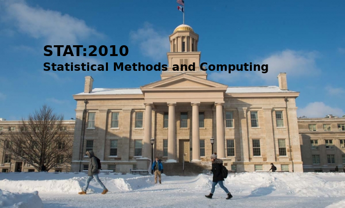

## Welcome to STAT:2010

### Instructor

- Name: Issac Lee
- E-mail: sak-lee@uiowa.edu
- Office: 213 Schaeffer Hall
- Office hours: 
  - Thursday 9:00 - 12:00 pm
  - Please feel free to make appointments to see me outside of office hours, and to send me questions by e-mail.

### Class Infomation

If you want to take different labs, please email me **in advance**.

- Labs (Place: **41 SH**)

  - Section A11: 10:30AM - 11:20AM Friday, 
  - Section A12: 11:30AM - 12:20AM Friday, 
  - Section A13: 12:30PM - 01:20PM Friday, 

- Textbook

  - Moore, Notz, and Fligner, The Basic Practice of Statistics, 6th ed. 2013, Freeman
  - Delwiche and Slaughter, The Little SAS Book, 5th ed., 2012

