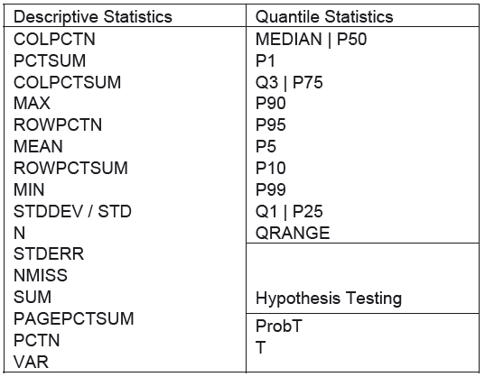

```{r setup, include=FALSE}
knitr::opts_chunk$set(echo = TRUE)
```


## Demonstration of the sampling distribution of $\overline{X}$

There is a good website for checking out the distribution of the sample mean $\overline{X}$. Let's click to the link below, then click “Begin” on the upper left corner.

[Implementing the Sampling Distribution](http://onlinestatbook.com/stat_sim/sampling_dist/)


## What are the plots on the screen

- The distribution displayed at the top of the screen is the population from which samples are taken.
- The second histogram displays the `sample data`.
- The third plot is used to display statistics calculated from samples from the population. This is the plot you should focus and understand.

## Draw a random sample

- $N=5$ means that we want to draw a sample of size 5
- “Mean” button means that we will calculate the sample mean.
- Click the button `Animated` once. You will see that a random sample of size 5 is drawn from the population. 
- The blue bar in the third histogram indicates the calculated sample mean. 
- Let us denote the sample mean by $\bar{x}^{(1)}$, where the superscript $(1)$ indicates that this statistic is calculated from the first sample that we draw.

### Repeat this 100 times!

- Click on the button “Animated” a second, a third, and a fourth, ... and keep going. - Make sure you wait long enough between clicks in order for the applet to complete the simulation each time. 
- If you click the `button 5` which is located at the right below of `Animated` button, it will automatically repeat the process five times for you.

**Q1**. How does the center and the spread of the histogram of $\bar{x}^{(1)}, \bar{x}^{(2)}, ..., \bar{x}^{(100)}$ compare to that of the population? That is, compare plot 3 to plot 1.

<details>
<summary>
<font color="red"> Answer </font>
</summary>

The center of the histograms are the same. However, the spread of the sample distribution much narrow.

</details>

## Sample distribution follows Normal distribution!

**This is important to understand.** We can see that the sample distribution in the simulator **always** follows `Normal` distribution if we draw the enough size of samples from the population distribution. Let us consider a random variable $X$ which follows Normal distribution. Thus,

$$
X \sim N(\mu, \sigma)
$$

then, the sample distribution with size of $n$ follows,

$$
\bar{X} \sim N(\mu, \frac{\sigma}{\sqrt{n}})
$$

One very important and magical thing you should recognize is that

- **The sample distribution follows `Normal` distribution even the population distribution `DOES NOT` follow `Normal` distribution!**

### Changing the population distribution

Note the tab to the right of plot 1. Change “Normal” to “Skewed”. This means we have our population distribution as other distribution which is not Normal distribution.

I would write like this,

$$
X \sim ?(\mu, \sigma)
$$
which indicates that we have information about mean and std. only. We don't know the exact distribution. However, if we have large sample size like larger than 16, then I can say,

$$
\bar{X} \sim N(\mu, \frac{\sigma}{\sqrt{n}})
$$

We can see the following things happen via simulator:

- If the samples (of size $N$) are drawn from a population that has a skewed distribution. Then the sampling distribution is skewed when $N$ is small ($N=2, 5$). 

- The sampling distribution looks much more symmetric and has an approximately normal distribution when N is large (for eg, when $N=25$).


## Using `proc tabulate` to make a table

### Gulanick data

Gulanick (Heart and Lung, 1991 ) studied patients who were recovering from heart surgery. She was interested in whether different combinations of supervised exercise or teaching would affect patients' self-efficacy (or confidence) to perform physical activity.

Patients were randomly assigned to one of three groups. 

- Group 1 received teaching, treadmill exercise testing, and exercise training three times per week. 
- Group 2 received only teaching and exercise testing. 
- Group 3 received only routine care without supervised exercise or teaching. 

After 4 weeks, each patient was scored on self-efficacy. Self-efficacy was measured on *a continuous scale and scores were assumed to be distributed normally* in each of the populations of interest. Her results are in the dataset “gulanick.dat.” We wish to produce a table that shows the number of observations and the mean and standard deviation of scores within each of the three groups.

```sas
proc format ;
value grpfmt 1 = 'Teaching and Training' 2 = 'Teaching' 3 = 'Neither' ;
run ;

filename dataurl url "http://homepage.stat.uiowa.edu/~kcowles/Datasets/gulanick.dat";
data gulan;
infile dataurl;
input score group;
format group grpfmt.;
run;
```

After you load the data, you can make a table as follows:

```sas
proc tabulate data = gulan ;
class group ;                 * class statement identifies qualitative variables ;
var score ;                   * var statement identifies quantitative variables ;
tables group , score * (N mean stddev) ;
run ;
```

```sas
---------------------------------------------------------
|                | score                                |
|                |--------------------------------------|
|                | N          | Mean       |        Std |
|----------------+------------+------------+------------|
|group           |            |            |            |
|----------------+------------+------------+------------|
|Teaching and    |            |            |            |
|Training        | 11.00      | 126.82     | 24.25      |
|----------------+------------+------------+------------|
|Teaching        | 12.00      | 128.42     | 25.04      |
|----------------+------------+------------+------------|
|Neither         | 13.00      | 103.92     | 17.71      |
---------------------------------------------------------
```

There are many options that you can use in `proc tabulate` as follows:



### One more option in `proc means`

You can also use `proc means` with `where` syntax option.

```sas
proc means data = gulan ;
var score ;
where group eq 1 ;           * restricts to those records with group = 1 ;
run ;
```

### Billion data

Here is the another practice SAS code for `billion` data.

```sas
proc format ;
value $regfmt 'A' = 'Asia' 'E' = 'Europe' 'M' = 'Middle East'
'O' = 'Other' 'U' = 'US' ;
value amtfmt low-<5 = '<5' 5-<10 = '5-<10' 10-<20 = '10-<20' 20-high = '20+' ;
run ;

filename bill url "http://homepage.divms.uiowa.edu/~kcowles/Datasets/billion.dat";
data billion ;
infile bill;
input wealth age region $ ;
format region $regfmt. wealth amtfmt. ;
label wealth = 'Wealth in Billion $'
age = 'Age in Years' ;
run ;
```

Let us make a summary table using region and age varible.

```sas
proc tabulate data = billion ;
class region ;
var age ;
tables region, age * (mean stddev) ;
run ;
```