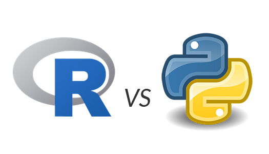

## R vs. Python

We know the two languages are dominant in the markets for data scientist. If we are able to use these two languages fluently, it will be awesome assets for our future. Sometimes, studying multiple languages at the same time help you to have a better understading each languages. This course designed by me for those who want to speak in both R and Python.